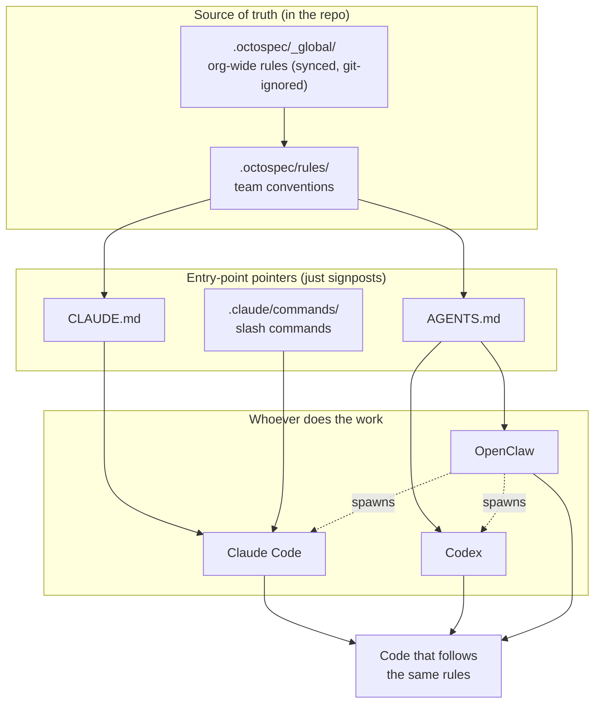
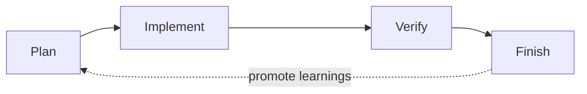

# octo-spec

[English](README.md) | [简体中文](README.zh-CN.md)

[](LICENSE)
[](https://github.com/Mininglamp-OSS/octo-spec/actions/workflows/octospec-lint.yml)
[](https://github.com/Mininglamp-OSS/octo-spec/tags)

**An out-of-the-box engineering standard for AI-assisted coding** — **git-native, zero-service**, stored in an **open format (OKF)**, with a **two-layer constitution** (org-wide `_global` rules + repo-local rules).

**Without octo-spec:** every new AI session you re-explain your conventions —
commit style, error handling, which rules this change touches — and the agent
still drifts.

**With octo-spec:** the standards live in the repo. `git pull` brings them, and
any coding agent reads and follows them automatically — no re-explaining.



**One source of truth (`.octospec/`), many entry points.**

AI writes code fast, but every session it starts from scratch — no memory of your
project, your conventions, or your team's requirements. octo-spec persists specs,
tasks, and project memory **into your repository**, so any coding agent works to
your team's engineering standards.

octo-spec is **git-native** and **Claude Code first**: there is no central server
to run and no extra service to install. Clone the repo, and the shared standards
come with it — reviewable, versioned, and improvable like any other code artifact.

## Prerequisites

- **git** — octo-spec is git-native; the standards travel with the repo.
- **bash** — to run `octospec-sync.sh` (onboarding) and the helper scripts.
- **python3** — required for onboarding: `octospec-sync.sh` invokes
  `octospec_sync_block.py` to bootstrap/update agent files (`CLAUDE.md`,
  `AGENTS.md`, …). The stdlib is enough here — no extra packages.
- **PyYAML** — additionally needed to run the OKF lint (`octospec-lint.sh`).
  Install with `pip install pyyaml`.
- A **coding agent** (Claude Code, Codex, OpenClaw, …) to execute the workflow.
  octo-spec ships the rules and scripts; the agent does the coding.

## Quick start

**Fastest path (zero shell): paste this one line to your coding agent** (Claude Code / Codex / OpenClaw):

> Read https://raw.githubusercontent.com/Mininglamp-OSS/octo-spec/v1.2.0/BOOTSTRAP.md and follow it to onboard octo-spec into this repo.

It clones the pinned octo-spec, then runs the standard `octospec-init` onboarding for you. The manual steps below remain the source of truth.

> Using Claude Code? The **`octospec-init`** skill walks an agent through this
> exact onboarding for you (copy → confirm pin → sync → verify). The manual steps
> below are the same thing by hand, and remain the source of truth.

```bash
# 1. Initialize the .octospec/ skeleton (the template ships its own sync scripts).
cp -r <path-to>/octo-spec/templates/octospec-init .octospec

# 2. Confirm the version pin in .octospec/manifest.yaml. The template ships
#    pinned to the current release, so onboarding at the same version needs no
#    edit. Then point GLOBAL_SRC at an octo-spec checkout of that SAME version —
#    the pin must match the checkout's VERSION file, or sync fails fast.
export GLOBAL_SRC=/path/to/octo-spec

# 3. Sync. This vendors the global rules into .octospec/_global/, writes the
#    octospec block into CLAUDE.md / AGENTS.md, AND materializes the repo-root
#    scaffolding tools expect: slash commands + the workflow skill to .claude/,
#    and the PR template to .github/. Works out of the box, idempotent.
./.octospec/scripts/octospec-sync.sh

# 4. Self-check: run the OKF lint (not vendored — run it from the checkout).
"$GLOBAL_SRC/scripts/octospec-lint.sh" .
```

That's it — **onboarding is complete**. The repo now carries the rules, the
agent-instruction block, the slash commands (under the repo-root `.claude/`,
so Claude Code discovers them), and the PR template (under `.github/`). Commit
the new files (`.octospec/`, root `.claude/`, `.github/`, and the updated
`CLAUDE.md` / `AGENTS.md`); from here every teammate just `git pull`s.

**How the loop runs from here:** ask your coding agent to "add a feature" / "fix
this bug", or drive a single phase explicitly with a slash command
(`/octospec-plan`, `/octospec-go`, `/octospec-check`, `/octospec-finish`). The
4-phase loop is executed **by the agent** — there is no loop CLI to paste (see
[The 4-phase loop](#the-4-phase-loop) below).

See [`docs/CLAUDE-WORKFLOW.md`](docs/CLAUDE-WORKFLOW.md) for the Claude Code slash
command workflow.

## Core ideas

| Capability | What it changes |
|---|---|
| **Auto-injected rules** | Write conventions once in `.octospec/rules/`, then let the relevant context be injected into each AI session instead of repeating yourself. |
| **Task-centered workflow** | Keep briefs, implementation context, and status in `.octospec/tasks/` so AI work stays structured. |
| **Project memory** | Shared journals in `.octospec/journal/` preserve what happened last time, so each new session starts with real context. |
| **Team-shared standards** | Specs live in the repo, so one person's hard-won rule benefits the whole team. |

## The 4-phase loop



```
Plan      → write a brief; AI may draft it from existing code, you confirm
Implement → AI writes code with the relevant rules auto-injected (no commit)
Verify    → diff is checked against rules + lint/type-check/tests, self-fixing
Finish    → a final check runs, then new learnings are promoted back into rules/
            in the same PR (no dead-letter; pending/ holds only unresolved ones)
```

> **The loop is executed by your coding agent — it is not a set of pasteable CLI
> commands.** A Claude Code slash command or the `octospec-workflow` skill drives
> the agent through these phases. **octo-spec itself ships no runtime engine**: its
> scripts only do **sync** (onboard / vendor global rules + materialize root
> scaffolding), **lint** (OKF conformance), and **learning-reflow** at Finish
> (`octospec-update-spec.sh`). The reasoning each phase needs is the agent's job.

## Two layers

octo-spec is split into two layers so shared standards and per-repo specifics
never fight each other:

- **Global ("constitution")** — this repository. Cross-repo conventions every
  project should follow: commit style, PR rules, review standards, security
  red lines, comprehension gate.
- **Per-repo ("local law")** — a `.octospec/` directory inside each business repo.
  Repo-specific rules that inherit from the global layer via a pinned version.

## Built on an open format (OKF)

octo-spec stores its rules, tasks, and journals as plain Markdown with YAML
frontmatter, compatible with the [Open Knowledge Format (OKF)](https://github.com/GoogleCloudPlatform/knowledge-catalog/blob/main/okf/SPEC.md)
v0.1 — an open, Apache-2.0 knowledge format from Google Cloud's Knowledge Catalog.

This is a deliberate choice: knowledge is best represented in commonly accessible,
established formats that are readable by humans without tooling, parseable by
agents without bespoke SDKs, diffable in version control, and portable across
tools and organizations. By aligning with OKF, an `.octospec/` directory is a
valid OKF knowledge bundle — any OKF-aware tool or agent can read it — while
octospec adds its own workflow layer (on-demand rule injection, the 4-phase loop,
and review gates) on top as permitted OKF extension fields.

## Directory layout (per-repo `.octospec/`)

```
.octospec/
  manifest.yaml          # inherited global version (pinned), repo tier, owner
  rules/                 # the rule source of truth (injected on demand)
    <domain>.md
    _index.yaml          # rule list + inject triggers + priority
  tasks/<slug>/
    brief.md             # goal / background / load-bearing list / acceptance
    context.yaml         # injected rule ids + injection fingerprint
  journal/shared/<slug>.md      # team-visible structural learnings
  journal/by-actor/<actor>/<slug>.md  # one actor's task-level notes (in-repo)
  learnings/pending/<slug>.md   # ONLY unresolved learnings needing human design
  scripts/
    octospec-update-spec.sh     # Finish-phase helper: drafts a rule + promotion
                                # issue body, or writes a per-actor journal entry
```

> Reusable learnings are promoted **in the same PR** at Finish (edit the relevant
> `rules/<rule>.md` in place, or add a new rule + `_index.yaml` entry) — the PR
> review is the gate. `learnings/pending/` is reserved only for *unresolved*
> learnings that still need human design before becoming a rule; finished
> learnings are never stranded waiting on a separate PR. The
> `.octospec/scripts/octospec-update-spec.sh` helper drafts these artifacts
> without ever writing `rules/` on main directly.

## OKF conformance

The knowledge files (the global rule files, any repo `rules/*.md`, and per-task
`tasks/**` briefs / `journal/**` entries) are valid OKF units: each starts with a
properly terminated YAML frontmatter block that parses as valid YAML and declares
a non-empty `type`. The structural files `index.md` and `log.md` are intentionally
exempt (OKF index/log are plain markdown with no frontmatter), as are fill-in
`*.template.md` scaffolds. CI enforces this with `scripts/octospec-lint.sh` (a
YAML-aware linter; needs `python3` + PyYAML), so the format never drifts. Run it
locally with:

```bash
./scripts/octospec-lint.sh .
```

> In an onboarded repo the lint covers your own `rules/` and `tasks/**`. The
> vendored `.octospec/_global/` is a read-only cache of rules already linted in
> this repo's CI, so it is out of the onboarded repo's lint scope by design.

A human-readable rule catalog lives in [`global/index.md`](global/index.md), and
the change history in [`global/log.md`](global/log.md).

## Resources

| Doc | What's inside |
|---|---|
| [Quick start](#quick-start) | Onboard a repo in four commands (copy → pin → sync → lint). |
| [Getting started](docs/GETTING-STARTED.md) | 5-minute guide + usage examples + diagrams. |
| [Integration architecture](docs/INTEGRATION.md) | How every entry point (Claude Code, Codex, Octo bots, dispatch) picks up the standard. |
| [Claude Code workflow](docs/CLAUDE-WORKFLOW.md) | Slash commands + the zero-install / materialization model. |
| [Change history](global/log.md) | Dated log of global-rule changes. |

## FAQ

<details>
<summary><strong>Do I need to install anything?</strong></summary>

No service to run. Once a maintainer has onboarded the repo and committed the
result, every teammate just `git pull`s — the rules, the agent block, the slash
commands, and the PR template all come with the repo. To run the OKF lint you
need `python3` + PyYAML (see [Prerequisites](#prerequisites)).
</details>

<details>
<summary><strong>Does octo-spec run the coding loop for me?</strong></summary>

No. octo-spec ships the rules and three scripts (sync / lint / learning-reflow).
The Plan→Implement→Verify→Finish loop is executed by your **coding agent** (via a
Claude Code slash command or the `octospec-workflow` skill). There is no runtime
engine and no loop CLI to paste.
</details>

<details>
<summary><strong>What if I don't use it?</strong></summary>

Nothing changes for you. `.octospec/` is additive — it adds files, touches no
runtime code, and blocks no merge. Delete `.octospec/` to fully roll back.
</details>

<details>
<summary><strong>Where do rules come from?</strong></summary>

This repo's existing conventions, made atomic and checkable. Propose new ones via
a normal PR to `.octospec/rules/`. Promoting a learning into a rule is a regular
reviewed PR — that's how the standard gets smarter without drifting silently.
</details>

<details>
<summary><strong>Why did sync write files outside <code>.octospec/</code>?</strong></summary>

By design. Claude Code only discovers slash commands / skills under the repo-root
`.claude/`, and GitHub only applies a PR template at the repo-root `.github/`. So
sync materializes those out of `.octospec/` to the root — install-if-missing
(never clobbers a file you've customized) and idempotent on re-run.
</details>

## License

octo-spec is licensed under the **Apache License 2.0**. See [LICENSE](LICENSE) and [NOTICE](NOTICE).

## Notes

<details>
<summary>Sync mechanics & caveats</summary>

- The template ships its own `scripts/` (`octospec-sync.sh` + `octospec_sync_block.py`), so the copied `.octospec/` carries the sync scripts themselves — you don't need a path back into the octo-spec checkout just to locate the scripts. The global rules are still sourced from an octo-spec checkout at sync time (see `GLOBAL_SRC`).
- Sync vendors the global rules into git-ignored `.octospec/_global/` AND writes the octospec agent-instruction block into your agent files (`CLAUDE.md` / `AGENTS.md` / `GEMINI.md` / `QWEN.md`), between managed markers.
- Sync also **materializes repo-root scaffolding** that tools only discover at the root: it copies `.octospec/.claude/` (slash commands + skill) to the repo-root `.claude/`, and `.octospec/.github/PULL_REQUEST_TEMPLATE.md` to `.github/`. This is install-if-missing — an existing destination file is left untouched, so hand-written customizations are never clobbered.
- Re-run any time you bump the pin; it is idempotent and preserves anything outside the markers — including the file's original line endings (LF/CRLF) and trailing newline. A second run reports the root scaffolding as already present.
- The scripts vendored under `.octospec/scripts/` are byte-for-byte copies of the canonical `scripts/octospec-sync.sh` and `scripts/octospec_sync_block.py` in this repo; CI (`scripts/test_octospec_sync_sh.sh`) asserts they stay identical, so the copy can never silently drift from the tested source. To upgrade the tooling itself, re-copy the template `scripts/` (or just the two files) from a newer octo-spec checkout.

</details>
