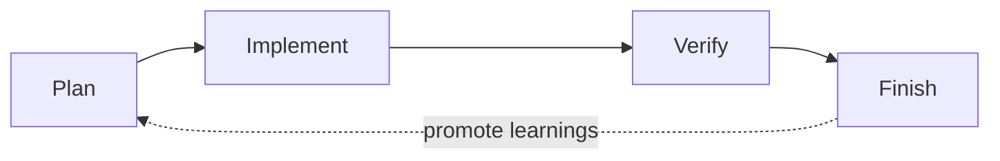

# octo-spec

**An out-of-the-box engineering standard for AI-assisted coding.**

AI writes code fast, but every session it starts from scratch — no memory of your
project, your conventions, or your team's requirements. octo-spec persists specs,
tasks, and project memory **into your repository**, so any coding agent works to
your team's engineering standards.

octo-spec is **git-native** and **Claude Code first**: there is no central server
to run and no extra service to install. Clone the repo, and the shared standards
come with it — reviewable, versioned, and improvable like any other code artifact.

## Built on an open format (OKF)

octo-spec stores its rules, tasks, and journals as plain Markdown with YAML
frontmatter, compatible with the [Open Knowledge Format (OKF)](https://github.com/GoogleCloudPlatform/knowledge-catalog/blob/main/okf/SPEC.md)
v0.1 — an open, Apache-2.0 knowledge format from Google Cloud's Knowledge Catalog.

This is a deliberate choice: knowledge is best represented in commonly accessible,
established formats that are readable by humans without tooling, parseable by
agents without bespoke SDKs, diffable in version control, and portable across
tools and organizations. By aligning with OKF, an `.octospec/` directory is a
valid OKF knowledge bundle — any OKF-aware tool or agent can read it — while
octospec adds its own workflow layer (on-demand rule injection, the 4-phase loop,
and review gates) on top as permitted OKF extension fields.

## Two layers

octo-spec is split into two layers so shared standards and per-repo specifics
never fight each other:

- **Global ("constitution")** — this repository. Cross-repo conventions every
  project should follow: commit style, PR rules, review standards, security
  red lines, comprehension gate.
- **Per-repo ("local law")** — a `.octospec/` directory inside each business repo.
  Repo-specific rules that inherit from the global layer via a pinned version.

## Core ideas

| Capability | What it changes |
|---|---|
| **Auto-injected rules** | Write conventions once in `.octospec/rules/`, then let the relevant context be injected into each AI session instead of repeating yourself. |
| **Task-centered workflow** | Keep briefs, implementation context, and status in `.octospec/tasks/` so AI work stays structured. |
| **Project memory** | Shared journals in `.octospec/journal/` preserve what happened last time, so each new session starts with real context. |
| **Team-shared standards** | Specs live in the repo, so one person's hard-won rule benefits the whole team. |

## The 4-phase loop



```
Plan      → write a brief; AI may draft it from existing code, you confirm
Implement → AI writes code with the relevant rules auto-injected (no commit)
Verify    → diff is checked against rules + lint/type-check/tests, self-fixing
Finish    → a final check runs, then new learnings are promoted back into rules/
```

## Directory layout (per-repo `.octospec/`)

```
.octospec/
  manifest.yaml          # inherited global version (pinned), repo tier, owner
  rules/                 # the rule source of truth (injected on demand)
    <domain>.md
    _index.yaml          # rule list + inject triggers + priority
  tasks/<slug>/
    brief.md             # goal / background / load-bearing list / acceptance
    context.yaml         # injected rule ids + injection fingerprint
  journal/shared/<slug>.md   # team-visible structural learnings
  learnings/pending/<slug>.md # finish-stage candidates awaiting promotion to rules/
```

> Personal scratch journals are **not** stored in the repo tree. They live in
> `~/.octospec/journal/<repo>/<user>/` (machine-local) to avoid leaking private
> notes into the repository or pull requests.

## Quick start

```bash
# 1. In a business repo, initialize the .octospec/ skeleton. The template ships
#    its own scripts/ (octospec-sync.sh + octospec_sync_block.py), so the copied
#    .octospec/ is self-contained — no path back into the octo-spec checkout is
#    needed to run the sync.
cp -r <path-to>/octo-spec/templates/octospec-init .octospec

# 2. Pin the global version in .octospec/manifest.yaml, then sync. Point
#    GLOBAL_SRC at a checkout of octo-spec at that pinned version.
GLOBAL_SRC=/path/to/octo-spec ./.octospec/scripts/octospec-sync.sh
#    This vendors the global rules into git-ignored .octospec/_global/ AND
#    writes the octospec agent-instruction block into your agent files
#    (CLAUDE.md / AGENTS.md / GEMINI.md / QWEN.md), between managed markers.
#    Re-run any time you bump the pin; it is idempotent and preserves anything
#    outside the markers — including the file's original line endings (LF/CRLF)
#    and trailing newline.
```

> The scripts vendored under `.octospec/scripts/` are byte-for-byte copies of the
> canonical `scripts/octospec-sync.sh` and `scripts/octospec_sync_block.py` in
> this repo; CI (`scripts/test_octospec_sync_sh.sh`) asserts they stay identical,
> so the copy can never silently drift from the tested source. To upgrade the
> tooling itself, re-copy the template `scripts/` (or just the two files) from a
> newer octo-spec checkout.

See [`docs/CLAUDE-WORKFLOW.md`](docs/CLAUDE-WORKFLOW.md) for the Claude Code slash
command workflow.

## Docs

- [Getting started](docs/GETTING-STARTED.md) — 5-minute guide + usage examples + diagrams
- [Claude Code workflow](docs/CLAUDE-WORKFLOW.md) — slash commands + zero-install model

## OKF conformance

The knowledge files (the global rule files, any repo `rules/*.md`, and per-task
`tasks/**` briefs / `journal/**` entries) are valid OKF units: each starts with a
properly terminated YAML frontmatter block that parses as valid YAML and declares
a non-empty `type`. The structural files `index.md` and `log.md` are intentionally
exempt (OKF index/log are plain markdown with no frontmatter), as are fill-in
`*.template.md` scaffolds. CI enforces this with `scripts/octospec-lint.sh` (a
YAML-aware linter; needs `python3` + PyYAML), so the format never drifts. Run it
locally with:

```bash
./scripts/octospec-lint.sh .
```

A human-readable rule catalog lives in [`global/index.md`](global/index.md), and
the change history in [`global/log.md`](global/log.md).

## License

See [LICENSE](LICENSE).
