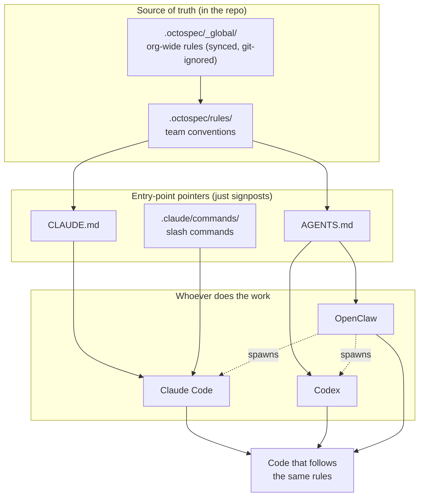
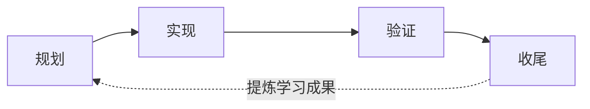

# octo-spec

[English](README.md) | [简体中文](README.zh-CN.md)

**面向 AI 辅助编码的开箱即用工程规范。**

**没有 octo-spec:** 每开一个新的 AI 会话,你都要把约定重讲一遍 —— 提交规范、
错误处理、这次改动碰了哪些规则 —— agent 照样跑偏。

**有了 octo-spec:** 规范就在仓库里。`git pull` 带过来,任何编码 agent 自动读取并
遵守 —— 不用重讲。



**一个真相源(`.octospec/`),多个入口点。**

AI 写代码很快,但每次会话都从零开始 —— 它记不住你的项目、你的约定,也记不住团队的需求。octo-spec
把规格(spec)、任务(task)和项目记忆 **持久化到你的仓库里**,这样任何编码 agent 都能按照你
团队的工程规范来工作。

octo-spec 是 **git 原生(git-native)** 且 **Claude Code 优先(Claude Code first)** 的:没有
需要运行的中心服务器,也没有需要额外安装的服务。克隆仓库,共享规范就一起带过来了 —— 可评审、
可版本化,像任何其他代码产物一样可持续改进。

## 快速开始

> 用 Claude Code? **octospec-init** skill 会带 agent 走完这套接入(拷贝 → 钉版本 → sync → 校验)。下面是同一件事的手动版。

```bash
# 1. 初始化 .octospec/ 骨架(模板自带 sync 脚本)
cp -r <path-to>/octo-spec/templates/octospec-init .octospec

# 2. 钉好 .octospec/manifest.yaml 里的全局版本后,sync(GLOBAL_SRC 指向该版本的 octo-spec checkout)
GLOBAL_SRC=/path/to/octo-spec ./.octospec/scripts/octospec-sync.sh

# 3. 自检:跑 OKF lint(lint 脚本不 vendor,从 checkout 跑)
"$GLOBAL_SRC/scripts/octospec-lint.sh" .
```

关于 Claude Code 的 slash 命令工作流,见 [`docs/CLAUDE-WORKFLOW.md`](docs/CLAUDE-WORKFLOW.md)。

## 核心理念

| 能力 | 它带来的改变 |
|---|---|
| **规则自动注入** | 在 `.octospec/rules/` 里把约定写一次,然后让相关上下文被注入到每次 AI 会话中,而不必反复重复你自己。 |
| **以任务为中心的工作流** | 把任务简报(brief)、实现上下文和状态都放在 `.octospec/tasks/` 里,让 AI 的工作保持结构化。 |
| **项目记忆** | `.octospec/journal/` 中的共享日志保留了上一次发生过什么,这样每个新会话都能带着真实上下文起步。 |
| **团队共享标准** | 规格存在仓库里,因此某个人来之不易的一条规则能惠及整个团队。 |

## 4 阶段循环



```
Plan      → 写一份简报;AI 可以从现有代码起草,由你确认
Implement → AI 在相关规则自动注入的情况下写代码(不提交)
Verify    → 对照规则 + lint/类型检查/测试来校验 diff,并自我修复
Finish    → 运行一次最终检查,然后把新的学习成果提炼回 rules/
```

## 两层模型

octo-spec 被拆分为两层,从而让共享标准与各仓库的具体细节互不冲突:

- **全局("宪法")** —— 即本仓库。每个项目都应遵循的跨仓库约定:提交规范、PR 规则、review
  标准、安全红线、理解力门禁(comprehension gate)。
- **每仓库("地方法")** —— 位于各业务仓库内部的一个 `.octospec/` 目录。仓库专属的规则,通过
  一个被钉住的版本(pinned version)继承自全局层。

## 构建于一种开放格式之上(OKF)

octo-spec 把它的规则、任务和日志(journal)存储为带 YAML frontmatter 的纯 Markdown,兼容
[Open Knowledge Format (OKF)](https://github.com/GoogleCloudPlatform/knowledge-catalog/blob/main/okf/SPEC.md)
v0.1 —— 一种来自 Google Cloud Knowledge Catalog、采用 Apache-2.0 许可的开放知识格式。

这是一个有意为之的选择:知识最好用通用易得、广泛确立的格式来表示 —— 无需工具人类即可阅读、
无需专用 SDK agent 即可解析、在版本控制中可 diff、并且可在工具与组织之间移植。通过对齐 OKF,
一个 `.octospec/` 目录就是一个有效的 OKF 知识包(knowledge bundle)—— 任何支持 OKF 的工具或
agent 都能读取它 —— 同时 octospec 在其之上,作为 OKF 允许的扩展字段(extension fields),叠加了
自己的工作流层(按需注入规则、4 阶段循环以及 review 门禁)。

## 目录布局(每仓库的 `.octospec/`)

```
.octospec/
  manifest.yaml          # 继承的全局版本(已钉住)、仓库层级(tier)、负责人
  rules/                 # 规则的唯一真相来源(按需注入)
    <domain>.md
    _index.yaml          # 规则清单 + 注入触发条件 + 优先级
  tasks/<slug>/
    brief.md             # 目标 / 背景 / 关键承重清单(load-bearing list) / 验收
    context.yaml         # 已注入的规则 id + 注入指纹(fingerprint)
  journal/shared/<slug>.md   # 团队可见的结构性学习成果
  learnings/pending/<slug>.md # 收尾阶段的候选项,等待提炼(promote)进 rules/
```

> 个人草稿日志 **不** 存储在仓库目录树中。它们位于
> `~/.octospec/journal/<repo>/<user>/`(机器本地),以避免把私人笔记泄漏进仓库或 pull request。

## OKF 一致性(conformance)

知识文件(全局规则文件、任何仓库的 `rules/*.md`,以及每任务的 `tasks/**` 简报 / `journal/**`
条目)都是有效的 OKF 单元:每个文件都以一个正确终止的 YAML frontmatter 块开头,该块能解析为
有效 YAML 并声明一个非空的 `type`。结构性文件 `index.md` 和 `log.md` 被有意豁免(OKF 的
index/log 是没有 frontmatter 的纯 markdown),需填空的 `*.template.md` 脚手架同样豁免。CI 通过
`scripts/octospec-lint.sh`(一个 YAML 感知的 linter;需要 `python3` + PyYAML)来强制执行这一点,
因此格式永远不会漂移。在本地运行:

```bash
./scripts/octospec-lint.sh .
```

一份人类可读的规则目录位于 [`global/index.md`](global/index.md),变更历史位于
[`global/log.md`](global/log.md)。

## 文档

- [快速上手](docs/GETTING-STARTED.md) —— 5 分钟指南 + 用法示例 + 图示
- [Claude Code 工作流](docs/CLAUDE-WORKFLOW.md) —— slash 命令 + 零安装模型
- [集成架构](docs/INTEGRATION.md) —— 每个入口点(Claude Code、Codex、Octo bots、派单)如何接入该标准

## 许可证

octo-spec 采用 **Apache License 2.0** 许可。见 [LICENSE](LICENSE) 和 [NOTICE](NOTICE)。

## 说明(Notes)

<details>
<summary>sync 机制与注意事项</summary>

- 模板自带它自己的 `scripts/`(`octospec-sync.sh` + `octospec_sync_block.py`),所以被复制出来的 `.octospec/` 自身就带着这些 sync 脚本 —— 你不需要为了定位脚本而保留一条回到 octo-spec checkout 的路径。全局规则在 sync 时仍然来源于一个 octo-spec checkout(见 `GLOBAL_SRC`)。
- sync 会把全局规则 vendor 进被 git 忽略的 `.octospec/_global/`,并且把 octospec 的 agent 指令块写入你的 agent 文件(`CLAUDE.md` / `AGENTS.md` / `GEMINI.md` / `QWEN.md`),写在受管标记(managed markers)之间。
- 每次你 bump 这个 pin 时都可以重新运行;它是幂等的,并且会保留标记之外的任何内容 —— 包括文件原有的行尾(LF/CRLF)和末尾换行符。
- vendor 进 `.octospec/scripts/` 的脚本是本仓库中规范来源 `scripts/octospec-sync.sh` 和 `scripts/octospec_sync_block.py` 的逐字节副本;CI(`scripts/test_octospec_sync_sh.sh`)会断言它们保持完全一致,因此副本绝不会悄悄偏离被测试过的源。要升级工具本身,就从一个更新的 octo-spec checkout 重新复制模板的 `scripts/`(或仅复制这两个文件)。

</details>
