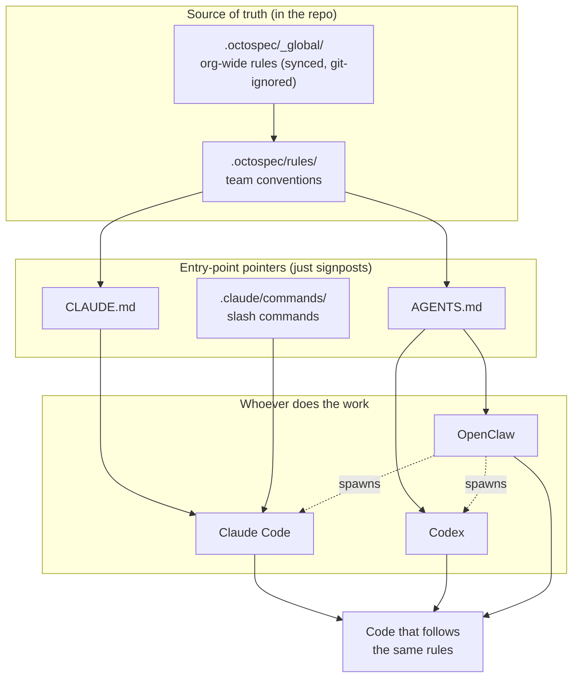
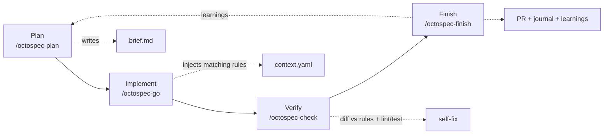

# Getting started with octo-spec

A 5-minute guide for team members. octo-spec keeps your team's coding rules
**in the repo**, so any AI agent works to the same standard — with nothing to
install.

---

## The big picture



**One source of truth (`.octospec/`), many entry points.** Adding a new tool =
add a signpost, not a new rulebook.

---

## The 4-phase loop



| Phase | Command | What happens |
|---|---|---|
| **Plan** | `/octospec-plan <task>` | AI drafts a task brief from the code; you confirm goal / load-bearing list / out-of-scope / acceptance. |
| **Implement** | `/octospec-go <slug>` | AI injects the rules whose `inject_when` matches your change, writes code (no commit). |
| **Verify** | `/octospec-check <slug>` | Diff is checked against those rules + lint/type-check/tests; self-fixes. |
| **Finish** | `/octospec-finish <slug>` | Final check, writes a shared journal entry, stages learnings, opens a PR with Linked Spec + COMPREHENSION pre-filled. |

---

## Usage examples

### A) Claude Code user (most common)

```
You:  /octospec-plan add a per-room mute toggle to the group settings API
AI:   (reads code) → writes .octospec/tasks/group-mute-toggle/brief.md
      Goal / load-bearing: ["space", "error-response"] / out-of-scope / acceptance
You:  looks good
You:  /octospec-go group-mute-toggle
AI:   injects space-isolation + error-handling rules → writes the handler + test
You:  /octospec-check group-mute-toggle
AI:   runs lint + go test, fixes an unlocalized error it introduced
You:  /octospec-finish group-mute-toggle
AI:   opens PR, body pre-filled with Linked Spec + COMPREHENSION answers
```

### B) OpenClaw drives a local Claude Code / Codex

Nothing special to do. The spawned agent works in the same checkout, so it reads
the same `.octospec/`. For Codex (reads `AGENTS.md`), the octospec pointer is
already there; for a code review, point Codex at the rules the diff touches.

### C) Pure agent / no slash commands

Any agent that opens the repo can read `.octospec/rules/_index.yaml`, see which
rules match the files it's touching, and read those rule files directly. The
slash commands are a convenience, not a requirement.

---

## What you have to do vs. what's automatic

| | Today (pilot) |
|---|---|
| Use the workflow | **Opt-in** — run the commands when you want them |
| Existing flow | **Unchanged** — `.octospec/` adds files, touches no runtime code, blocks no merge |
| Spec/COMPREHENSION in PRs | Requested by the template, **not yet CI-enforced** |
| Rollback | Delete `.octospec/` — fully reversible |

> A future, separately-approved step can turn on a CI gate that **fails**
> load-bearing PRs missing a spec. That is not on in the pilot — first we verify
> the team finds the rules useful.

---

## FAQ

**Do I need to install anything?** No. `git pull` brings the rules and the slash
commands with the repo.

**What if I don't use it?** Nothing changes for you. It's additive.

**Where do rules come from?** This repo's existing conventions, made atomic and
checkable. You can propose new ones via a normal PR to `.octospec/rules/`.

**Who keeps it updated?** Everyone — promoting a learning into a rule is a normal
reviewed PR. That's how the standard gets smarter.
