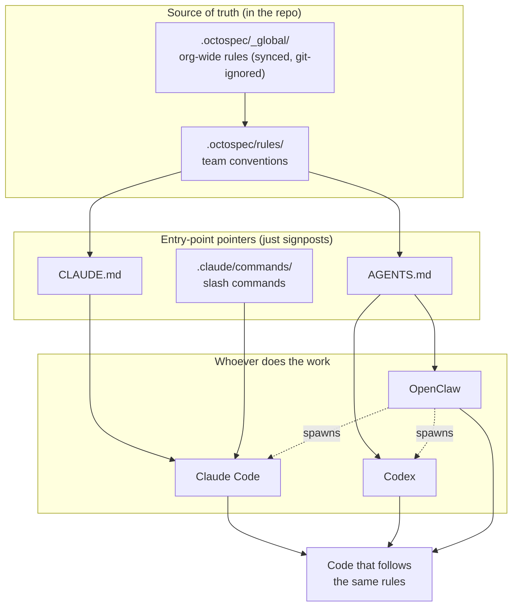

# Getting started with octo-spec

A 5-minute guide for team members. octo-spec keeps your team's coding rules
**in the repo**, so any AI agent works to the same standard — with nothing to
install.

---

## The big picture


```mermaid
flowchart TD
    subgraph SOT["Source of truth (in the repo)"]
        R[".octospec/rules/<br/>team conventions"]
        G[".octospec/_global/<br/>org-wide rules (synced, git-ignored)"]
    end

    subgraph Pointers["Entry-point pointers (just signposts)"]
        C["CLAUDE.md"]
        A["AGENTS.md"]
        CMD[".claude/commands/<br/>slash commands"]
    end

    subgraph Agents["Whoever does the work"]
        CC["Claude Code"]
        CX["Codex"]
        OC["OpenClaw"]
    end

    R --> C & A
    G --> R
    C --> CC
    CMD --> CC
    A --> CX
    A --> OC
    OC -.spawns.-> CC
    OC -.spawns.-> CX

    CC & CX & OC --> OUT["Code that follows<br/>the same rules"]
```

**One source of truth (`.octospec/`), many entry points.** Adding a new tool =
add a signpost, not a new rulebook.

---

## The 6-phase loop

```mermaid
flowchart LR
    D["Discover<br/>/octospec discover"] --> P["Plan<br/>/octospec plan"]
    P --> G{"approved?<br/>/octospec approve"}
    G -->|yes| I["Implement<br/>/octospec implement"]
    G -->|no| P
    I --> V["Verify<br/>/octospec verify"]
    V -->|pass| F["Finish<br/>/octospec finish"]
    V -->|fail| IT["Iterate<br/>/octospec iterate"]
    IT -->|impl-only| V
    IT -->|spec-changing| P
    F -.learnings.-> D

    D -.writes.-> DS["discovery.md"]
    P -.writes.-> B["brief.md (revision)"]
    I -.injects matching rules.-> CODE["code"]
    V -.diff vs rules + verify.gate.-> FIX["self-fix"]
    F -.->PR["PR + journal + learnings"]
```

| Phase | Command | What happens |
|---|---|---|
| **Discover** | `/octospec discover <task>` | Read-only exploration of the code the task touches → `discovery.md`. Grounds the load-bearing list. |
| **Plan** | `/octospec plan <slug>` | Derive the brief (Goal / load-bearing list / out-of-scope / acceptance) from discovery. Stops for approval. |
| **Approve** | `/octospec approve <slug>` | A human signs off the brief's current revision. Implement is blocked until this exists. |
| **Implement** | `/octospec implement <slug>` | Gate-checks approval, injects the rules whose `inject_when` matches, writes code (no commit). |
| **Verify** | `/octospec verify <slug>` | Diff checked against those rules + acceptance; runs `manifest.verify.gate`; self-fixes. |
| **Iterate** | `/octospec iterate <slug>` | Optional rework: impl-only → re-Verify; spec-changing → bump revision + re-approve. |
| **Finish** | `/octospec finish <slug>` | Final check, journal entry, learnings landed in-PR, PR opened with Linked Spec + COMPREHENSION. |

---

## Usage examples

### A) Claude Code user (most common)

```
You:  /octospec discover add a per-room mute toggle to the group settings API
AI:   (reads code) → writes .octospec/tasks/group-mute-toggle/discovery.md
You:  /octospec plan group-mute-toggle
AI:   → writes brief.md (r1): Goal / load-bearing ["space","error-response"] / ...
You:  /octospec approve group-mute-toggle
AI:   records approval for revision 1
You:  /octospec implement group-mute-toggle
AI:   gate OK → injects space-isolation + error-handling rules → writes handler + test
You:  /octospec verify group-mute-toggle
AI:   runs manifest.verify.gate, fixes an unlocalized error it introduced
You:  /octospec finish group-mute-toggle
AI:   opens PR, body pre-filled with Linked Spec (r1, approved) + COMPREHENSION
```

### B) OpenClaw drives a local Claude Code / Codex

Nothing special to do. The spawned agent works in the same checkout, so it reads
the same `.octospec/`. For Codex (reads `AGENTS.md`), the octospec pointer is
already there; for a code review, point Codex at the rules the diff touches.

### C) Pure agent / no slash commands

Any agent that opens the repo can read `.octospec/rules/_index.yaml`, see which
rules match the files it's touching, and read those rule files directly. The
slash commands are a convenience, not a requirement.

---

## What you have to do vs. what's automatic

| | Today (pilot) |
|---|---|
| Use the workflow | **Opt-in** — run the commands when you want them |
| Existing flow | **Unchanged** — `.octospec/` adds files, touches no runtime code, blocks no merge |
| Spec/COMPREHENSION in PRs | Requested by the template, **not yet CI-enforced** |
| Rollback | Delete `.octospec/` — fully reversible |

> A future, separately-approved step can turn on a CI gate that **fails**
> load-bearing PRs missing a spec. That is not on in the pilot — first we verify
> the team finds the rules useful.

---

## FAQ

**Do I need to install anything?** No. `git pull` brings the rules and the slash
commands with the repo.

**What if I don't use it?** Nothing changes for you. It's additive.

**Where do rules come from?** This repo's existing conventions, made atomic and
checkable. You can propose new ones via a normal PR to `.octospec/rules/`.

**Who keeps it updated?** Everyone — promoting a learning into a rule is a normal
reviewed PR. That's how the standard gets smarter.
