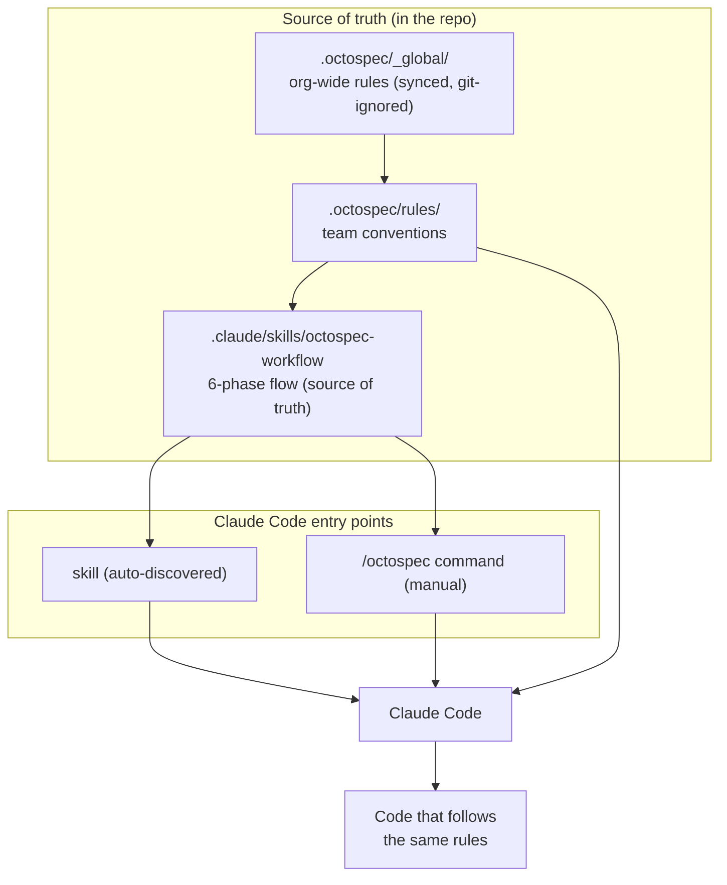

# Getting started with octo-spec

A 5-minute guide for team members. octo-spec keeps your team's coding rules
**in the repo**, so any AI agent works to the same standard — with nothing to
install.

---

## The big picture


```mermaid
flowchart TD
    subgraph SOT["Source of truth (in the repo)"]
        R[".octospec/rules/<br/>team conventions"]
        G[".octospec/_global/<br/>org-wide rules (synced, git-ignored)"]
        SK[".claude/skills/octospec-workflow<br/>6-phase flow (source of truth)"]
    end

    subgraph Entry["Claude Code entry points"]
        SKILL["skill (auto-discovered)"]
        CMD["/octospec command (manual)"]
    end

    CC["Claude Code"]

    R --> SK
    G --> R
    SK --> SKILL
    SK --> CMD
    SKILL --> CC
    CMD --> CC
    R --> CC

    CC --> OUT["Code that follows<br/>the same rules"]
```

**One source of truth (`.octospec/` + the workflow skill), Claude-Code-first.**
Governance for non-Claude agents happens at the PR gate; distributing the skill
to their native dirs is planned (see `docs/INTEGRATION.md`).

---

## The 6-phase loop

```mermaid
flowchart LR
    D["Discover<br/>/octospec discover"] --> P["Plan<br/>/octospec plan"]
    P --> G{"approved?<br/>/octospec approve"}
    G -->|yes| I["Implement<br/>/octospec implement"]
    G -->|no| P
    I --> V["Verify<br/>/octospec verify"]
    V -->|pass| F["Finish<br/>/octospec finish"]
    V -->|fail| IT["Iterate<br/>/octospec iterate"]
    IT -->|impl/test-only| V
    IT -->|spec-changing| P
    F -.learnings.-> D

    D -.branch + writes.-> DS["discovery.md (committed)"]
    P -.writes.-> B["spec.md (revision)"]
    I -.Red→Green→Refactor.-> CODE["red tests → code"]
    V -.independent reviewer + red trail + verify.gate.-> FIX["reviewer findings"]
    F -.->PR["PR + slim journal + learnings"]
```

| Phase | Command | What happens |
|---|---|---|
| **Discover** | `/octospec discover <task>` | Create the task branch; read-only exploration of the code the task touches → `discovery.md` (committed). Grounds the load-bearing list. |
| **Plan** | `/octospec plan <slug>` | Derive the spec (Goal / load-bearing list / out-of-scope / acceptance) from discovery; commit it. Acceptance is written to become failing tests. Stops for approval. |
| **Approve** | `/octospec approve <slug>` | A human signs off the spec's current revision (recorded + committed). Implement is blocked until this exists. |
| **Implement** | `/octospec implement <slug>` | Gate-checks approval, injects matching rules, then **TDD**: commit failing Acceptance tests (`red:`) before code, write minimal code to green, refactor. |
| **Verify** | `/octospec verify <slug>` | An **independent reviewer** (fresh context) checks the diff vs rules + acceptance + out-of-scope, confirms the `red:` trail (tests failed first, encode Acceptance, not weakened); runs `manifest.verify.gate`. No self-review. |
| **Iterate** | `/octospec iterate <slug>` | Optional rework: impl/test-only → re-Verify (test fix is its own commit); spec-changing → bump revision + re-approve. |
| **Finish** | `/octospec finish <slug>` | Final check, slim journal (result + Learning), learnings landed in-PR, PR opened with Linked Spec + COMPREHENSION. |
| **Autopilot** | `/octospec autopilot <slug>` | After approval, runs Implement (Red→Green→Refactor) → Verify → (impl/test-only Iterate ≤2) → Finish unattended, stopping at "PR opened". Never auto-merges. |

---

## Usage examples

### A) Claude Code user (most common)

```
You:  /octospec discover add a per-room mute toggle to the group settings API
AI:   (reads code) → writes .octospec/tasks/group-mute-toggle/discovery.md
You:  /octospec plan group-mute-toggle
AI:   → writes spec.md (r1): Goal / load-bearing ["space","error-response"] / ...
You:  /octospec approve group-mute-toggle
AI:   records approval for revision 1
You:  /octospec implement group-mute-toggle
AI:   gate OK → injects space-isolation + error-handling rules
      → writes failing tests for A1–A4, commits `red: group-mute-toggle`
      → writes handler until green → refactors, stays green
You:  /octospec verify group-mute-toggle
AI:   dispatches an independent reviewer (checks red trail + Acceptance), runs manifest.verify.gate
You:  /octospec finish group-mute-toggle
AI:   opens PR, body pre-filled with Linked Spec (r1, approved) + COMPREHENSION
```

Once the spec is approved, the middle phases are mechanical — collapse them with
autopilot:

```
You:  /octospec approve group-mute-toggle
You:  /octospec autopilot group-mute-toggle
AI:   Implement (Red→Green→Refactor) → independent Verify → (impl/test-only Iterate ≤2) → Finish → PR opened
      (stops for you only if the spec must change, or retries run out)
```

### B) An orchestrator drives a local Claude Code

Nothing special to do. The spawned Claude Code works in the same checkout, so it
auto-discovers the `octospec-workflow` skill and reads the same `.octospec/`. The
orchestrator gathers requirements and dispatches; the anchored Claude Code writes
the code under the standard.

### C) A non-Claude agent, or any agent without the skill

Any agent that opens the repo can read `.octospec/rules/_index.yaml`, see which
rules match the files it's touching, and read those rule files directly — the
standard is plain files in the repo. octospec doesn't yet ship its workflow into
non-Claude agents' skill dirs (planned — see `docs/INTEGRATION.md`), so for those
the **PR gate** is what enforces the standard.

---

## What you have to do vs. what's automatic

| | Today (pilot) |
|---|---|
| Use the workflow | **Opt-in** — run the commands when you want them |
| Existing flow | **Unchanged** — `.octospec/` adds files, touches no runtime code, blocks no merge |
| Spec/COMPREHENSION in PRs | Requested by the template, **not yet CI-enforced** |
| Rollback | Delete `.octospec/` — fully reversible |

> A future, separately-approved step can turn on a CI gate that **fails**
> load-bearing PRs missing a spec. That is not on in the pilot — first we verify
> the team finds the rules useful.

---

## FAQ

**Do I need to install anything?** No. `git pull` brings the rules and the slash
commands with the repo.

**What if I don't use it?** Nothing changes for you. It's additive.

**Where do rules come from?** This repo's existing conventions, made atomic and
checkable. You can propose new ones via a normal PR to `.octospec/rules/`.

**Who keeps it updated?** Everyone — promoting a learning into a rule is a normal
reviewed PR. That's how the standard gets smarter.
